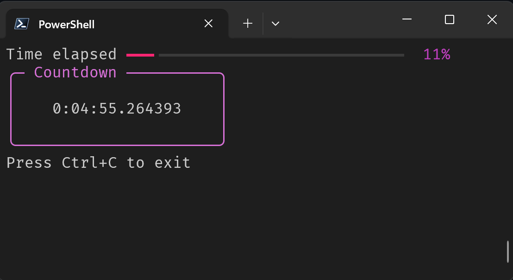

# Countdown

## Built With
`Python`! Yes, python...good for what you code in it for.

### Which libraries does it use?
* `rich`
* standard `datetime`
* and `click`

### How is it packaged?
Countdown uses uv and pyinstaller for packaging as a project, as an executable or as a script. So you can *just run it* :)

## How do I use it?
To run, use either on of
* `countdown`
* `uv run main.py`
and provide the `times` argument in the format %M:%S

e.g. `uv run main.py 5:30`

e.g. `countdown 3:54`
